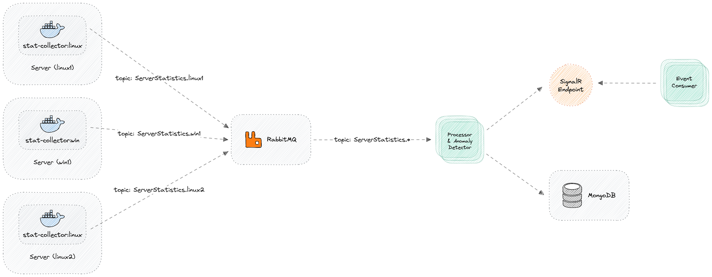

# ServerMonitoring

A distributed server monitoring system built with .NET 10 that collects system metrics, detects anomalies, and provides real-time alerts via SignalR.

## Architecture Overview



## Components

### 1. ServerMonitoring.StatsCollector
**Worker service** that runs on each monitored server to collect system statistics.

- **Cross-platform support**: Linux (`/proc/stat`, `/proc/meminfo`), Windows (Performance Counters), macOS (`top`, `vm_stat`)
- **Metrics collected**: CPU usage (%), Memory usage (MB), Available memory (MB)
- **Publishing**: Sends stats to RabbitMQ topic exchange with routing key `ServerStatistics.{serverId}`
- **Configuration**: Sampling interval, server identifier

### 2. ServerMonitoring.MessageQueue
**Shared library** providing RabbitMQ messaging abstractions.

- `IMessagePublisher` - Publish messages to topic exchange
- `IMessageConsumer` - Subscribe to topic patterns with automatic dead-letter queue support
- Automatic connection recovery and topology recovery
- Configurable: exchange, queue, durability, prefetch count, dead-letter settings

### 3. ServerMonitoring.Processor
**Worker service** that processes statistics from RabbitMQ.

- **Storage**: Saves statistics to MongoDB
- **Anomaly Detection**: Detects sudden spikes in CPU/memory vs previous reading
  - Configurable threshold percentages for memory and CPU anomaly detection
- **High Usage Alerts**: Triggers when usage exceeds absolute thresholds
  - Memory usage percentage threshold
  - CPU usage percentage threshold
- **Alerting**: Sends alerts via HTTP to NotificationService

### 4. ServerMonitoring.SignalR
**Shared library** for real-time notifications via SignalR.

- `INotificationPublisher` - Server-side: broadcasts events to all connected clients
- `INotificationListener` - Client-side: subscribes to events with automatic reconnection
- `NotificationsHub` - SignalR hub at `/hubs/alerts`

### 5. ServerMonitoring.NotificationService
**ASP.NET Core Web API** that bridges HTTP alerts to SignalR.

- **Endpoint**: `POST /alerts` - Receives alert from Processor, publishes to SignalR
- **Hub**: Maps `NotificationsHub` at `/hubs/alerts`
- **Health check**: `GET /health`

### 6. ServerMonitoring.EventConsumer
**Worker service** that demonstrates consuming real-time alerts.

- Connects to SignalR hub
- Subscribes to `AnomalyAlert` and `HighUsageAlert` events
- Prints formatted alerts to console

## Data Models

### ServerStatistics
```csharp
public class ServerStatistics
{
    public string ServerIdentifier { get; set; }
    public double MemoryUsage { get; set; }      // MB
    public double AvailableMemory { get; set; }  // MB
    public double CpuUsage { get; set; }         // Percentage
    public DateTime Timestamp { get; set; }      // UTC
}
```

### AlertMessage
```csharp
public class AlertMessage
{
    public string AlertType { get; set; }        // "AnomalyAlert" | "HighUsageAlert"
    public string ServerIdentifier { get; set; }
    public string Metric { get; set; }           // "Memory" | "Cpu"
    public string Message { get; set; }
    public DateTime Timestamp { get; set; }      // UTC
}
```

## Configuration

### StatsCollector (`appsettings.json`)
```json
{
  "ServerStatisticsConfig": {
    "SamplingIntervalSeconds": 60,
    "ServerIdentifier": "linux1"
  },
  "RabbitMq": {
    "HostName": "localhost",
    "Port": 5672,
    "UserName": "guest",
    "Password": "guest",
    "VirtualHost": "/",
    "ExchangeName": "server.events"
  }
}
```

### Processor (`appsettings.json`)
```json
{
  "AnomalyDetectionConfig": {
    "MemoryUsageAnomalyThresholdPercentage": 0.4,
    "CpuUsageAnomalyThresholdPercentage": 0.5,
    "MemoryUsageThresholdPercentage": 0.8,
    "CpuUsageThresholdPercentage": 0.9
  },
  "MongoConfig": {
    "ConnectionString": "mongodb://localhost:27017",
    "DatabaseName": "ServerMonitoring",
    "CollectionName": "ServerStatistics"
  },
  "RabbitMq": {
    "HostName": "localhost",
    "ExchangeName": "server.events",
    "QueueName": "processor-queue"
  },
  "NotificationService": {
    "BaseUrl": "http://localhost:8080"
  }
}
```

### EventConsumer (`appsettings.json`)
```json
{
  "SignalR": {
    "HubUrl": "http://localhost:8080/hubs/alerts",
    "RetryDelaySeconds": 5
  }
}
```

## Running with Docker Compose

```bash
docker-compose up --build
```

### Services Started
| Service | Container | Ports | Description |
|---------|-----------|-------|-------------|
| RabbitMQ | `rabbitmq` | 5672, 15672 | Message broker with management UI |
| MongoDB | `mongodb` | 27017 | Database for statistics |
| Mongo Express | `mongo-express` | 8081 | MongoDB web UI (admin/admin) |
| StatsCollector (x3) | `stat-collector-linux1/2/3` | - | Simulated Linux servers |
| Processor | `processor` | - | Statistics processor & anomaly detector |
| NotificationService | `notification-service` | 8080 | Alert API + SignalR hub |
| EventConsumer | `event-consumer` | - | Console alert listener |

### Environment Variables (docker-compose.yml)
Each StatsCollector instance gets unique `ServerIdentifier`:
- `linux1`, `linux2`, `linux3` - simulates 3 monitored servers
- `SamplingIntervalSeconds=10` - collects every 10 seconds for demo

## Local Development

### Prerequisites
- .NET 10 SDK
- RabbitMQ (localhost:5672)
- MongoDB (localhost:27017)

### Run Services Individually
```bash
# Terminal 1 - StatsCollector
cd ServerMonitoring.StatsCollector
dotnet run

# Terminal 2 - Processor
cd ServerMonitoring.Processor
dotnet run

# Terminal 3 - NotificationService
cd ServerMonitoring.NotificationService
dotnet run

# Terminal 4 - EventConsumer
cd ServerMonitoring.EventConsumer
dotnet run
```

### Send Test Alert (for testing SignalR)
```bash
curl -X POST http://localhost:8080/alerts \
  -H "Content-Type: application/json" \
  -d '{
    "alertType": "AnomalyAlert",
    "serverIdentifier": "test-server",
    "metric": "Memory",
    "message": "Test alert from curl",
    "timestamp": "2024-01-15T10:30:00Z"
  }'
```

## Alert Types

### AnomalyAlert
Triggered when a metric increases **suddenly** compared to previous reading:
- Memory: `current > previous * (1 + MemoryUsageAnomalyThresholdPercentage)`
- CPU: `current > previous * (1 + CpuUsageAnomalyThresholdPercentage)`

Default thresholds: 40% for memory, 50% for CPU

### HighUsageAlert
Triggered when absolute usage exceeds threshold:
- Memory: `MemoryUsage / (MemoryUsage + AvailableMemory) > MemoryUsageThresholdPercentage`
- CPU: `CpuUsage > CpuUsageThresholdPercentage * 100`

Default thresholds: 80% memory, 90% CPU

## Extending the System

### Add New Statistics Provider
1. Implement `IServerStatisticsProvider` in `ServerMonitoring.StatsCollector.Providers`
2. Register in `ServerStatisticsProviderFactory.Create()`

### Add New Alert Channel
1. Implement `IAlertNotifier` in `ServerMonitoring.Processor.Alerts`
2. Register in `Processor/Program.cs`

### Add New EventConsumer
1. Create new Worker project
2. Reference `ServerMonitoring.SignalR`
3. Use `AddSignalRNotificationListener()` and implement `AlertListenerWorker` pattern

## Project Structure
```
ServerMonitoring/
├── ServerMonitoring.sln
├── docker-compose.yml
├── README.md
├── ServerMonitoring.StatsCollector/          # Metrics collection worker
│   ├── Providers/                            # OS-specific implementations
│   ├── IProviders/                           # Interface & Factory
│   ├── Models/                               # ServerStatistics
│   └── Options/
├── ServerMonitoring.MessageQueue/            # RabbitMQ abstractions
│   ├── IRabbitMQ/                            # Interfaces
│   ├── RabbitMQ/                             # Implementation
│   ├── Options/                              # RabbitMqOptions
│   └── DependencyInjection/
├── ServerMonitoring.Processor/               # Processing & anomaly detection
│   ├── Alerts/                               # Alert types & notifiers
│   ├── Interfaces/Repositories/              # MongoDB repository
│   ├── Repositories/
│   ├── Models/
│   └── Options/
├── ServerMonitoring.SignalR/                 # SignalR shared library
│   ├── Hubs/
│   ├── Interfaces/Services/
│   ├── Implementations/Services/
│   ├── Options/
│   └── DependencyInjection/
├── ServerMonitoring.NotificationService/     # Web API + SignalR host
│   ├── Models/
│   └── Program.cs
└── ServerMonitoring.EventConsumer/           # SignalR client demo
    ├── Models/
    └── AlertListenerWorker.cs
```

## Technology Stack
- **.NET 10** / C# 13
- **RabbitMQ** - Message broker (topic exchange pattern)
- **MongoDB** - Time-series statistics storage
- **SignalR** - Real-time WebSocket notifications
- **Docker** - Containerization
- **System.Diagnostics.PerformanceCounter** - Windows metrics